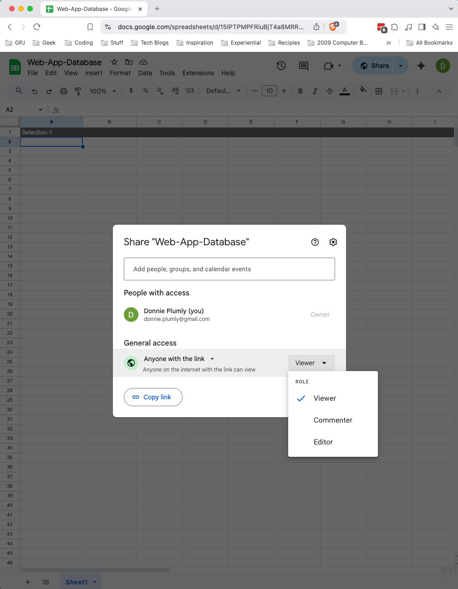
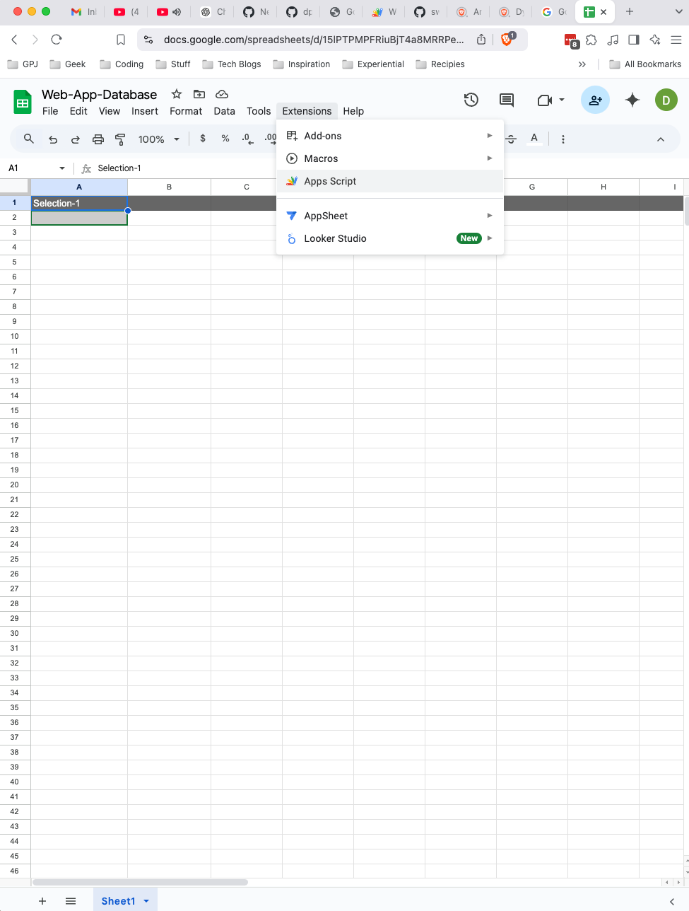
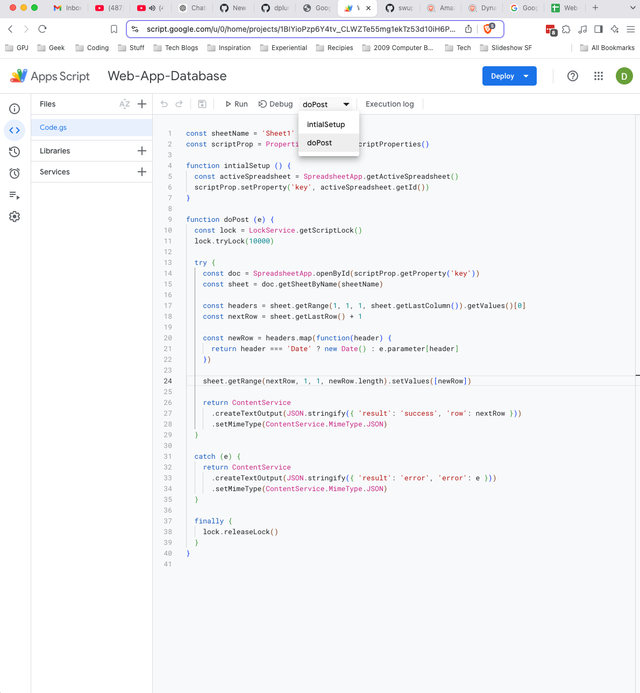
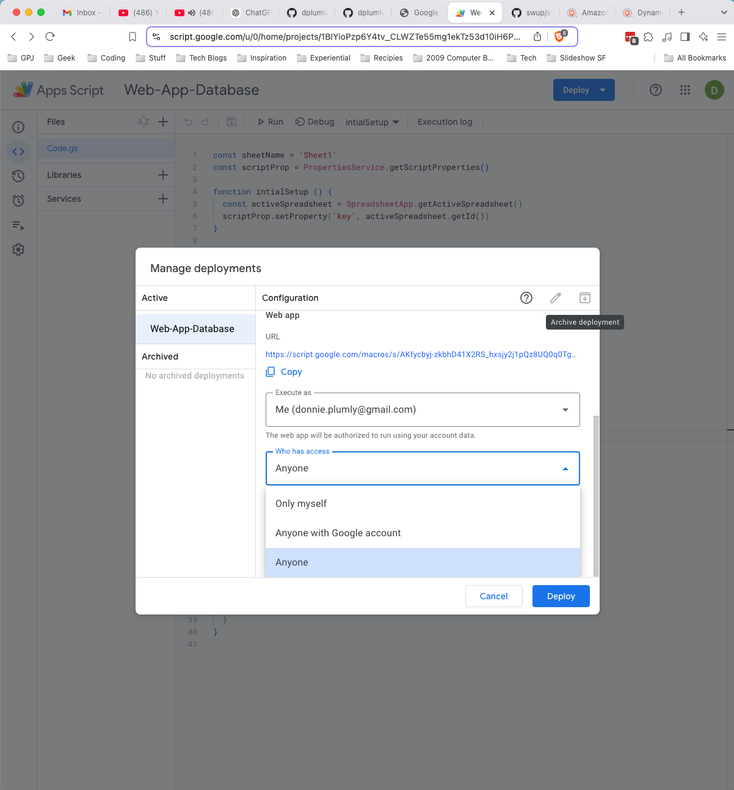

Simple form to Google Sheets Database. Example with radio buttons and a submit button that logs the answer in a Google Sheet. 

1. Set up a Google Sheet.

2. Click "<strong>Share</strong>" with the downward arrow. The Veiwer can be set to anything. I leave it as Veiw, but make sure to set the "<strong>General Access</strong>" to "<strong>Any one with link</strong>"

 

4. Go to "<strong>Extentions</strong>", select "<strong>Apps Script</strong>".

 

5. Add the code from "<strong>appscript.js</strong>" in the js folder. Make sure in the dropdown you have the proper function selected. In this case it is the doPost function.

 

6. Click "<strong>Deploy</strong>" with the downward arrow. It will bring up a box. This box will give you the URL you need to add into your form. Make sure you set the "<strong>Who has access</strong>" to "<strong>Anyone</strong>". 

 
 
This project is still under construction and based off the repo from Github user levinunnink, https://github.com/levinunnink/html-form-to-google-sheet
